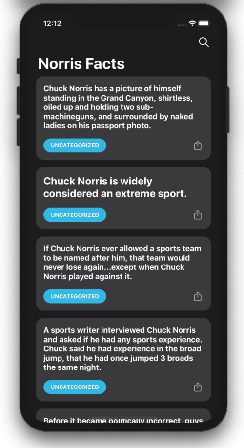
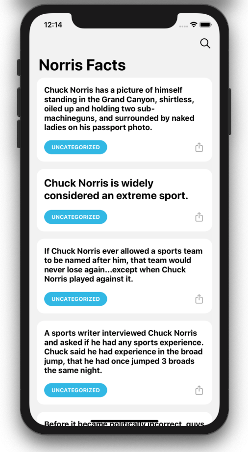

# Norris Facts (norris-facts-ios)

An iOS app that shows Chuck Norris facts and let you share the facts with your friends.
This app uses the [ChuckNorris API](https://api.chucknorris.io) to request the facts and facts suggestions.

----

## Screenshots

All screens can be found in the [design](./Design/norris-facts.xd) file and any changes in the UI needs to update the design file first.

<p align="center">
  
  
</p>

## Requirements
This app was built and test using this tools/environments. No guarantee that this app runs on previous versions of these tools.

1. Xcode 11.4.1
2. Swift 5
3. Cocoapods version `1.9.3`

## Getting Started
1. Clone this repository
2. Run `pod install`
3. Run project 🎉

## Architecture

This app conforms to [**MVVM** (Model-View-ViewModel)](https://en.wikipedia.org/wiki/Model%E2%80%93view%E2%80%93viewmodel) pattern to help us with unit tests and [Coordinators](https://will.townsend.io/2016/an-ios-coordinator-pattern) which is responsible for the application's navigation flow.

In this project we adopt the reactive programing style and we use [RxSwift](https://github.com/ReactiveX/RxSwift) for it. We use reactive programing to bind view models properties to the view controlers, call for API requests and/or listen for database changes and also to get rid of delegate methods to link Coordinators, View Models and View Controllers.

### Dependencies
> All of dependencies and third libraries used in this project as well as its versions can be found in [Podfile](./Podfile).

- [SwiftLint](https://github.com/realm/SwiftLint) to maintain a good code quality
- [SwiftGen](https://github.com/SwiftGen/SwiftGen) to generate a type-safe reference for resources (Localizable.strings and Assets).
- [RealmSwift](https://realm.io/docs/swift/latest/) to save facts offline
- [RxSwift/RxCocoa](https://github.com/ReactiveX/RxSwift) to bind views and reactive code
- [RxDataSources](https://github.com/RxSwiftCommunity/RxDataSources) to bind viewModels on tableView
- [RxRealm](https://github.com/RxSwiftCommunity/RxRealm) to observe database changes
- [Lottie](https://github.com/airbnb/lottie-ios) to show loading animation

## Fastlane
This project use the [Fastlane](https://fastlane.tools) to automate the development and release process. To use it we need to install the dependencies in [Gemfile](./Gemfile) first. This will install `Cocoapods`, `Fastlane` and its plugins used in fastlane scripts.

```sh
$ bundle install
```

#### Scripts  
- Run tests and UI tests (this runs on all pull requests)
  ```sh 
  $ bundle exec fastlane ios tests
  ```

- Run release process (this runs on all push to master branch)
  ```sh 
  $ bundle exec fastlane ios release
  ```


## Future works
- Add more tests and increase code coverage percentage
- Add tool to track code coverage. Ex: CodeCov
- Add fastlane scripts to auto generate GitHub release tags
- Add support for more languages (translate the `Localizable.strings`)
- Notifications with random facts
- Widget with random facts
- Add support for iPad
- Add support for Mac
- Add app for AppleWatch
- Add A11n for accessibility


> Special thanks for [flaticon](https://www.flaticon.com) for the free assets.